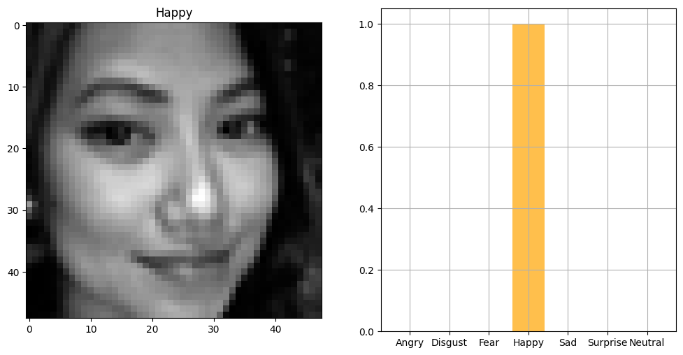
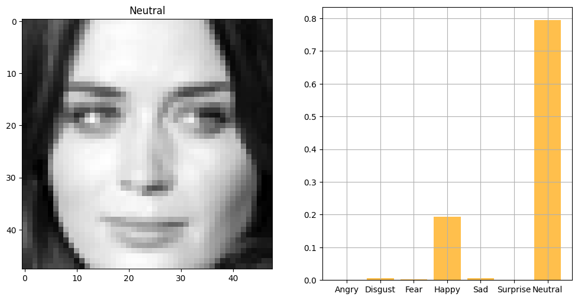
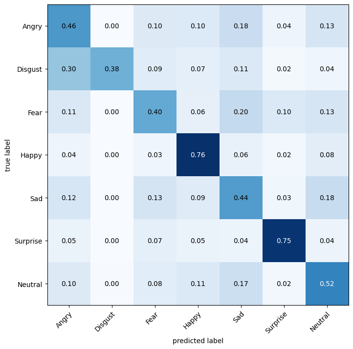

# facial-expression-detection

## Introduction

This project is a facial expression detection system based on deep learning. The system can detect 7 different facial expressions: anger, disgust, fear, happiness, sadness, surprise and neutral. The system is built with Python and Keras. The dataset used is [FER-2013](https://www.kaggle.com/c/challenges-in-representation-learning-facial-expression-recognition-challenge/data) from Kaggle. The model is trained on local machine. The model is trained with 80% of the dataset and tested with 20% of the dataset. The model is trained with 50 epochs and the accuracy is 57%. The model is saved as a .h5 file. The model is then used in the system to detect facial expressions.

## Requirements

- Python 3.6
- Keras
- Numpy
- Pandas
- Matplotlib
- Scikit-learn
- Jupyter Notebook
- Tensorflow

## Deep Learning

Deep learning is a subfield of machine learning that focuses on building and training artificial neural networks to learn and make predictions from large amounts of data. It is inspired by the structure and functioning of the human brain, specifically the interconnected neurons and their ability to process information.

## Convolutional Neural Network

Convolutional Neural Networks (CNNs) are a type of deep learning network commonly used for image and video recognition tasks. They are designed to automatically extract and learn meaningful features from visual data, such as edges, textures, and patterns.

## Facial Expression Detection

Facial expression recognition using deep learning and convolutional neural networks (CNNs) involves training a model to automatically detect and classify different facial expressions, such as happiness, sadness, anger, and surprise, from images or video frames.

The implementation typically follows these steps:

### 1. Prepare the Dataset

The first step is to prepare the dataset. The dataset used is [FER-2013](https://www.kaggle.com/c/challenges-in-representation-learning-facial-expression-recognition-challenge/data) from Kaggle. The dataset contains 48x48 pixel grayscale images of faces. The faces have been automatically registered so that the face is more or less centered and occupies about the same amount of space in each image. The task is to categorize each face based on the emotion shown in the facial expression in to one of seven categories (0=Angry, 1=Disgust, 2=Fear, 3=Happy, 4=Sad, 5=Surprise, 6=Neutral).

### 2. Setup the CNN

The next step is to setup the CNN. The CNN is built with Python and Keras. The CNN is built with 4 convolutional layers and 2 fully connected layers. The CNN is trained with 50 epochs. The accuracy of the CNN is 57%. The convolutional layers will extract relevant features from the images and the fully connected layers will focus on using these features to classify well our images.

### 3. Train, Validate and Test the CNN

The next step is to train the CNN. The CNN is trained with 80% of the dataset and tested with 20% of the dataset. The model is trained with 50 epochs and the accuracy is 57%. The model is saved as a .h5 file.

### 4. Analyze the Results

our model is able to detect facial expressions with 57% accuracy. The model is able to detect happy and surprise facial expressions with high accuracy. The model is confused to detect between disgust and anger facial expressions.
